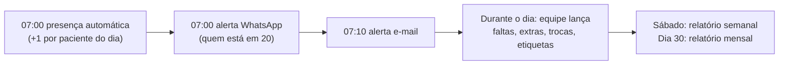

# ReusoPro — Gestão de Reuso de Capilares (Hemodiálise)

Código-fonte da lógica completa do sistema ReusoPro, preparado para ser incorporado em outro projeto.
**Este pacote não contém dados de pacientes, credenciais, `.env`, chaves ou qualquer informação sensível.**
Todos os exemplos usam valores fictícios.

---

## 1. Contexto do domínio

Em clínicas de hemodiálise, o **capilar** (dialisador/filtro) de cada paciente é reprocessado e reutilizado
em várias sessões até um **limite de 20 usos**. O sistema controla:

- quantos usos o capilar atual de cada paciente já teve (**contador de reuso**, 0 a 20);
- a **presença diária** (que incrementa o contador) e as **faltas**;
- a **troca do capilar** (por limite atingido ou descarte antecipado por defeito), com histórico;
- a **etiqueta** física colada no capilar (impressora térmica Zebra);
- o mapa fixo de **boxes/poltronas** por salão e turno;
- **alertas diários** de quem chegou ao limite (WhatsApp/e-mail) e **relatórios PDF** de trocas.

Organização da unidade usada pelo sistema:

| Conceito | Valores |
|---|---|
| Escala (dias fixos do paciente) | `SEG_QUA_SEX` (seg/qua/sex) ou `TER_QUI_SAB` (ter/qui/sáb) |
| Salão (sala de tratamento) | 1, 2, 3 |
| Turno | 1, 2, 3 |
| Box / posição | 8 boxes × 4 posições, por salão + turno |

---

## 2. Stack

| Camada | Tecnologia |
|---|---|
| Backend | Node.js ≥ 18, Express 4, `pg` (PostgreSQL), JWT (`jsonwebtoken`) + `bcryptjs`, `helmet`, `express-rate-limit` |
| Banco | PostgreSQL (usado em produção no Supabase; funciona em qualquer Postgres ≥ 13) |
| Agendamento | `node-cron` (servidor sempre ligado) **ou** Vercel Cron Jobs (serverless) |
| PDF | `pdfkit` |
| Armazenamento de PDFs | Supabase Storage (`@supabase/supabase-js`) — trocável |
| Notificações | WhatsApp Cloud API (Meta, `fetch` nativo) e SMTP (`nodemailer`) |
| Frontend | React 18 + Vite 5, React Router 6, Tailwind CSS 4, Framer Motion, Axios |
| Impressão de etiqueta | ZPL direto na Zebra via *Zebra Browser Print*, ou HTML + diálogo de impressão do navegador |
| Deploy de referência | Vercel (frontend e backend) + Supabase (Postgres + Storage) |

---

## 3. Estrutura do projeto

```
reusopro/
├── backend/
│   ├── api/                      # Entradas serverless (Vercel)
│   │   ├── index.js              #   toda a API Express
│   │   └── cron/                 #   uma função por job agendado (+ _handlerCron.js: auth CRON_SECRET)
│   ├── src/
│   │   ├── app.js                # Express: middlewares + rotas (sem listen)
│   │   ├── server.js             # Entrada para servidor sempre ligado (listen + node-cron)
│   │   ├── domain/
│   │   │   └── regrasNegocio.js  # ★ Regras puras (sem I/O): limite, capilar por peso, escalas, contador
│   │   ├── services/             # ★ Lógica de negócio + SQL (independente de Express)
│   │   │   ├── pacientesService.js
│   │   │   ├── sessoesService.js       # presença/falta/contador/presença automática
│   │   │   ├── trocasService.js        # troca de capilar
│   │   │   ├── alertaLimiteService.js  # quem está no limite + envio WhatsApp/e-mail
│   │   │   ├── relatoriosService.js
│   │   │   └── usuariosService.js      # login, usuários, senha
│   │   ├── controllers/          # HTTP ↔ service (finos, sem regra de negócio)
│   │   ├── routes/               # Definição de rotas + autenticação/permissão
│   │   ├── middleware/           # auth (JWT), erros (HttpErro + handler central)
│   │   ├── reports/              # Geração de PDFs e textos de alerta
│   │   ├── integrations/         # WhatsApp, e-mail, storage (trocáveis)
│   │   ├── jobs/                 # Corpo das tarefas agendadas + agendador node-cron
│   │   ├── utils/datas.js        # Datas 'YYYY-MM-DD' no fuso da clínica
│   │   └── db/                   # pool, transação, schema.sql, migrate, seedAdmin
│   ├── vercel.json               # rewrites + horários dos crons (UTC)
│   └── .env.example
└── frontend/
    └── src/
        ├── pages/                # Dashboard, Pacientes, PerfilPaciente, Etiquetas, Trocas, Escalas, Relatórios, Usuários, Login
        ├── components/           # Cards, modais de troca, etiqueta HTML, painel de aproveitamento...
        ├── hooks/                # useTema, useImpressoraZebra
        ├── utils/                # regras.js (espelho das regras), datas, zpl, etiquetaConfig, periodo
        ├── services/api.js       # Axios + token + logout automático em 401
        └── context/AuthContext.jsx
```

**Para portar a lógica**, os pontos centrais são `backend/src/domain/regrasNegocio.js` (regras puras) e
`backend/src/services/*` (cada função recebe dados simples e devolve dados simples; erros esperados são
lançados como `HttpErro(status, mensagem)`). Controllers e rotas são apenas a casca HTTP.

---

## 4. Modelo de dados

Schema completo e idempotente em [`backend/src/db/schema.sql`](backend/src/db/schema.sql).

| Tabela | Papel | Campos-chave |
|---|---|---|
| `users` | Equipe que usa o sistema | `username` (único, minúsculo), `senha_hash` (bcrypt), `role` (`admin`/`operador`), `ativo` |
| `pacientes` | Cadastro + estado atual do capilar | `peso_kg`, `capilar`, `capilar_manual`, `escala`, `turno`, `salao`, `dia_extra_fixo`, `box`/`posicao_box`, `reuso_atual` (0–20), `capilar_desde`, `capilar_lote`, `nome_mae`, `ativo` (soft delete) |
| `sessoes` | Uma linha por paciente por dia | `data_sessao`, `status` (`REALIZADA`/`FALTA`/`PENDENTE`), `reuso_antes`, `reuso_no_momento`, `capilar_no_momento`, `registrado_por` (NULL = automático) — único por (paciente, data) |
| `trocas_capilar` | Histórico de trocas (fonte dos relatórios) | snapshot `paciente_nome/salao/turno`, `capilar_anterior/novo`, `reuso_no_momento`, `motivo` (`LIMITE_20_USOS`/`DESPREZADO_MANUAL`), `motivo_detalhe` |
| `relatorios` | PDFs gerados | `tipo` (`SEMANAL`/`MENSAL`), período, `arquivo_path` (no storage), `total_trocas` |

Restrições importantes: índice único parcial garante **1 paciente ativo por slot** (salão+turno+box+posição);
`reuso_atual` tem `CHECK 0..20`; RLS habilitado sem policies (bloqueia a API pública do Supabase; o backend
conecta como dono das tabelas e não é afetado).

---

## 5. Regras de negócio

### 5.1 Capilar pelo peso
| Peso | Capilar |
|---|---|
| > 100 kg | B22H |
| > 90 kg | B21H |
| > 80 kg | B20H |
| > 60 kg | B18H |
| ≤ 60 kg | B16H |

- Recalculado sempre que o peso muda.
- **Exceção clínica** (`capilar_manual = true`): o capilar é escolhido manualmente e **nunca** é recalculado
  (nem ao editar peso, nem ao trocar o capilar). Desligar a exceção volta ao cálculo por peso.

### 5.2 Contador de reuso e presença
- **Presença é automática**: todo dia às 07:00, cada paciente ativo da escala do dia (ou com
  `dia_extra_fixo` naquele dia da semana) recebe uma sessão `REALIZADA` e **+1** no contador (teto 20).
  É idempotente: quem já tem sessão na data é ignorado.
- A equipe só lança **exceções**. Transições do contador para a sessão de um dia:

| Status anterior → novo | Efeito no contador |
|---|---|
| (nenhum) / PENDENTE → REALIZADA | +1 |
| FALTA → REALIZADA (desfazer falta) | +1 |
| REALIZADA → FALTA | −1 (desfaz o +1 automático, mínimo 0) |
| (nenhum) / PENDENTE → FALTA | 0 (nenhum uso aconteceu) |
| mesmo status repetido | 0 (idempotente) |

- **Trava de segurança**: lançar presença com o contador em 20 é recusado (HTTP 409) — o capilar precisa
  ser trocado antes.
- **Sessão extra**: presença lançada num dia fora da escala do paciente. Aparece marcada como "extra".
- **Sessão extra fixa** (`dia_extra_fixo`): um dia adicional fixo na semana; entra na presença automática e
  nos alertas.
- **Remover lançamento**: apaga a sessão e restaura o contador para `reuso_antes` **somente se** o contador
  não mudou desde aquele lançamento (`reuso_atual == reuso_no_momento`); caso contrário só apaga, para não
  desfazer uma troca/lançamento posterior.
- **Status visual**: `NORMAL` (< 18), `ATENCAO` (18–19, amarelo), `CRITICO` (20, vermelho).

### 5.3 Troca de capilar
- Motivos: `LIMITE_20_USOS` ou `DESPREZADO_MANUAL` (exige `motivo_detalhe`; a interface oferece: Baixa
  Prime/BP, Coagulação, Ruptura externa, Ruptura interna, Fuga de sangue, Outro + texto).
- Em uma transação: grava o histórico com snapshot do paciente (nome, salão, turno, capilar, usos) →
  zera o contador → define o novo capilar (exceção mantém o modelo; senão recalcula pelo peso) →
  `capilar_lote` opcional → `capilar_desde` = `data_inicio` informada ou hoje.
- Não existe troca automática: toda troca é confirmada por uma pessoa (Dashboard, Pacientes ou Etiquetas).
- Excluir um registro de troca (só admin) apaga apenas o histórico; o estado atual do paciente não muda.

### 5.4 Etiquetas de capilar
- Fluxo: selecionar pacientes → informar **Prime Inicial (PI)** e **data do primeiro uso** → opcionalmente
  registrar a troca de capilar de todos → imprimir.
- **Prime Final (PF) = PI − 20%**, arredondado. Faixa usual do PI: 100–140 (fora disso só alerta).
- Conteúdo: nome (fonte menor para nomes longos), data de nascimento, nome da mãe (obrigatório no cadastro
  por causa da etiqueta), PI, PF, sorologia, modelo do capilar, data do primeiro uso.
- Sorologia impressa é **fixa** por protocolo da unidade (`HCV-`, `HIV-`, `ANTI HBS+`) — configurável em
  `frontend/src/utils/etiquetaConfig.js`.
- Ao confirmar a troca na impressão, o novo capilar começa na **data do primeiro uso** da etiqueta.
- Impressão: com *Zebra Browser Print* instalado e o SDK em `frontend/public/browserprint.js`, envia ZPL
  direto (203 dpi, etiqueta padrão 102×44 mm); sem ele, gera HTML no tamanho exato e abre o diálogo do
  navegador. Logo opcional (`LOGO_URL` / `LOGO_ZPL`, vazio por padrão).

### 5.5 Escalas (boxes)
- Para cada salão + turno: 8 boxes × 4 posições. Alocar/desalocar exige box e posição juntos.
- Um slot só aceita um paciente **ativo**; desativar o paciente libera o slot.

### 5.6 Alertas de limite
Lista = pacientes ativos esperados no dia (escala do dia ou extra fixa) com contador em 20, agrupados por
salão e turno. Canais independentes (falha em um não afeta o outro; sem configuração, apenas registra log):
- **WhatsApp (07:00)**: template aprovado na Meta com resumo de 1 linha no corpo `{{1}}` + PDF anexado.
- **E-mail (07:10)**: tabela HTML (nome, turno, salão, nascimento, capilar).
- **Botão manual no Dashboard**: abre `wa.me` com o texto completo já formatado.

### 5.7 Relatórios
- **Semanal** (sábado): trocas dos últimos 7 dias. **Mensal** (dia 30): trocas do dia 1 ao dia 30.
- PDF com resumo (total, por limite, por descarte) e tabela detalhada; salvo no storage e registrado em
  `relatorios`. Admin pode gerar o semanal manualmente.

### 5.8 Painel de aproveitamento (tela Trocas)
Aproveitamento = média de `reuso_no_momento / 20` das trocas filtradas (período, salão, turno). Mede quanto
cada capilar realmente rendeu antes de sair de uso. Com "todos os salões" quebra por salão; com um salão,
quebra por turno.

### 5.9 Usuários e segurança
- `admin`: gerencia usuários, gera relatórios manuais, exclui registros de troca, testa alertas.
  `operador`: operação do dia a dia.
- JWT de 12 h; a cada request confere se o usuário continua ativo (cache de 60 s), então desativar corta o
  acesso quase imediatamente.
- Login com rate limit (10 tentativas / 15 min por IP), senha mínima de 8 caracteres, bcrypt.
- CORS restrito a `FRONTEND_URL`; `helmet`; erros internos nunca expõem detalhes ao cliente.
- Rotas de cron exigem `Authorization: Bearer <CRON_SECRET>` (sem a variável, tudo é recusado).

### 5.10 Datas e fuso
Todas as datas de negócio são `YYYY-MM-DD` no fuso `America/Sao_Paulo` (configurável por `APP_TIMEZONE`),
independente do fuso do servidor. Colunas `DATE` voltam do banco como string.

---

## 6. Ciclo diário



| Job | Horário (Brasília) | `node-cron` (`src/jobs/agendador.js`) | Vercel (`vercel.json`, UTC) |
|---|---|---|---|
| Presença automática + WhatsApp | 07:00 diário | `0 7 * * *` | `0 10 * * *` |
| Alerta por e-mail | 07:10 diário | `10 7 * * *` | `10 10 * * *` |
| Relatório semanal | sábado | `59 23 * * 6` (23:59) | `59 23 * * 6` (20:59 BRT) |
| Relatório mensal | dia 30 | `59 23 30 * *` (23:59) | `59 23 30 * *` (20:59 BRT) |

---

## 7. API

Base: `/api`. Todas as rotas (exceto login e health) exigem `Authorization: Bearer <token>`.
Respostas de erro: `{ "erro": "mensagem" }`.

| Método | Rota | Permissão | Descrição |
|---|---|---|---|
| POST | `/auth/login` | público | `{ username, senha }` → `{ token, usuario }` |
| PATCH | `/auth/senha` | logado | `{ senhaAtual, novaSenha }` |
| GET / POST | `/auth/usuarios` | admin | listar / criar `{ nome, username, senha, role }` |
| PATCH | `/auth/usuarios/:id/ativo` | admin | ativar/desativar |
| GET | `/pacientes?escala=&turno=&salao=` | logado | ativos, com `status_visual` |
| GET | `/pacientes/:id` | logado | |
| GET | `/pacientes/:id/historico` | logado | perfil + sessões + trocas |
| POST / PUT | `/pacientes`, `/pacientes/:id` | logado | criar / atualização parcial |
| PUT | `/pacientes/:id/box` | logado | `{ box, posicao_box }` (nulls desalocam) |
| DELETE | `/pacientes/:id` | logado | desativa (soft delete) |
| GET | `/sessoes/hoje?data=YYYY-MM-DD` | logado | pacientes esperados no dia + status da sessão |
| GET | `/sessoes/dia?data=YYYY-MM-DD` | logado | faltas e sessões extras do dia |
| POST | `/sessoes/:pacienteId/realizar` | logado | `{ data? }` presença |
| POST | `/sessoes/:pacienteId/falta` | logado | `{ data? }` falta |
| DELETE | `/sessoes/:sessaoId` | logado | remove lançamento (reverte contador se seguro) |
| POST | `/trocas/:pacienteId/trocar` | logado | `{ motivo, motivo_detalhe?, novo_capilar_lote?, data_inicio? }` |
| GET | `/trocas?inicio=&fim=` | logado | histórico |
| DELETE | `/trocas/:id` | admin | apaga registro do histórico |
| GET | `/relatorios` · `/relatorios/:id/download` | logado | lista / PDF |
| POST | `/relatorios/gerar` | admin | `{ tipo, inicio, fim }` |
| GET | `/whatsapp/mensagem-limite-hoje` | logado | texto para o botão `wa.me` |
| POST | `/whatsapp/testar` · `/email/testar` | admin | dispara o alerta de hoje na hora |
| GET | `/health` | público | status |

---

## 8. Rodando localmente

Pré-requisitos: Node 18+ e um PostgreSQL acessível.

```bash
cd backend
npm install
cp .env.example .env        # preencha DATABASE_URL e JWT_SECRET
npm run migrate             # cria as tabelas (idempotente)
npm run seed:admin          # cria o primeiro admin (senha aleatória se ADMIN_SENHA vazio)
npm run dev                 # API em http://localhost:3001 + agendador
```

```bash
cd frontend
npm install
cp .env.example .env        # VITE_API_URL=http://localhost:3001/api
npm run dev                 # http://localhost:5173
```

`DISABLE_SCHEDULER=true` desliga os jobs no `server.js` (útil em desenvolvimento).

## 9. Variáveis de ambiente (backend)

Veja [`backend/.env.example`](backend/.env.example). Obrigatórias: `DATABASE_URL`, `JWT_SECRET`,
`FRONTEND_URL`; em serverless também `CRON_SECRET`. Storage (`SUPABASE_*`) é necessário para relatórios.
WhatsApp (`WHATSAPP_*`) e e-mail (`SMTP_*`, `EMAIL_*`) são opcionais.

## 10. Deploy

- **Servidor tradicional** (VM, Railway, Render…): `npm start` no backend — sobe a API e o `node-cron`.
- **Vercel (serverless)**: projeto com raiz `backend/` (preset *Other*) — `api/index.js` serve a API e
  `vercel.json` agenda os crons; projeto com raiz `frontend/` (preset *Vite*) com `VITE_API_URL`.
- Storage dos PDFs: bucket privado `relatorios` no Supabase. Para outro provedor, reimplemente
  `salvarPdf`/`baixarPdf` em `backend/src/integrations/storage.js`.

---

## 11. Integrando em outro sistema

- **Regras puras** (`domain/regrasNegocio.js`) podem ser copiadas como estão; o frontend tem um espelho em
  `frontend/src/utils/regras.js` — mantenha os dois iguais (ou exponha as regras por API).
- **Services** usam apenas `pool`/`comTransacao` de `db/pool.js`; basta apontar para o seu banco ou trocar
  pelo seu ORM. Não dependem de Express.
- **Autenticação**: se o sistema de destino já tem login, substitua `middleware/auth.js` e
  `usuariosService.js`; os services só precisam do `id` do usuário para `registrado_por`.
- **Integrações** (WhatsApp, e-mail, storage) estão isoladas em `integrations/` e podem ser trocadas.
- Identificadores, tabelas e textos da interface estão em português (ver glossário abaixo); os comentários
  do código estão em inglês.

## 12. Ajustes feitos nesta versão (em relação à versão em produção)

Reorganização sem mudar o comportamento, exceto pelas correções abaixo:

1. **Camada de serviços**: a lógica saiu dos controllers para `services/`; erros centralizados (`HttpErro`).
2. **Schema consolidado**: as migrações incrementais viraram um único `schema.sql`; removida a coluna
   `automatico` (era da troca automática às 19h, que já tinha sido desativada).
3. **Fuso horário**: datas calculadas no fuso de São Paulo (antes, em servidor UTC, "hoje" virava amanhã
   após 21h e relatórios/filtros por data podiam cair no dia errado). Colunas `DATE` retornam como string.
4. **Contador idempotente**: repetir presença ou falta no mesmo dia não altera mais o contador; falta sem
   presença prévia não decrementa (antes descontava um uso que não existiu).
5. **Validações**: turno inválido, data mal formatada, UUID inválido e JSON malformado retornam 400 (antes 500).
6. **E-mail**: nomes escapados no HTML. **PDF de alerta**: removido emoji que não renderiza nas fontes padrão.
7. **Frontend**: constantes/regras duplicadas centralizadas em `utils/`; painéis de lançamento do Dashboard
   unificados (`PainelBuscaPaciente`); impressora Zebra isolada em `useImpressoraZebra`; etiqueta HTML em
   `EtiquetaCapilar`; rotas em tabela.
8. **Removidos por conter dados sensíveis/identidade**: número de telefone fixo no código, e-mail e nome
   pessoais no `.env.example`, logo e marca da clínica, scripts de importação de pacientes, relatórios de
   auditoria e histórico Git.

## 13. Limitações conhecidas

- Relatório mensal roda no dia 30: em fevereiro não há relatório automático (dá para gerar manualmente via
  `POST /relatorios/gerar` ou mudar a regra para "último dia do mês").
- Remover uma falta que tinha substituído uma presença restaura o contador com o +1, mas apaga a sessão do
  dia; nesse caso relance a presença pelo Dashboard só se o paciente de fato não tiver sido contado.
- Rate limit de login é em memória (por instância em serverless).
- A troca em lote ao imprimir etiquetas é feita paciente a paciente; se uma falhar, as anteriores permanecem.

## 14. Glossário (PT → EN)

| Termo no código | Significado |
|---|---|
| paciente | patient |
| capilar | dialyzer (filter) |
| reuso / `reuso_atual` | reuse count of the current dialyzer |
| sessão / `sessoes` | dialysis session (one per patient per day) |
| falta | absence (no-show) |
| troca de capilar | dialyzer replacement |
| desprezo / descarte | early discard |
| escala | weekly schedule (Mon/Wed/Fri or Tue/Thu/Sat) |
| salão | treatment room |
| turno | shift |
| box / posição | station / seat |
| etiqueta | label |
| prime (PI / PF) | priming volume (initial / final) |
| sorologia | serology |
| relatório | report |
| operador | operator (staff role) |
